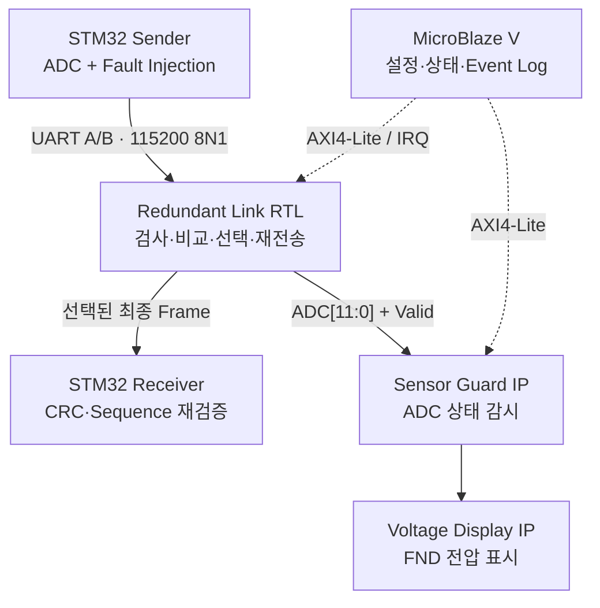

# Basys3 SoC 기반 이중화 UART/RS-422 통신 게이트웨이

Basys3 FPGA, MicroBlaze V, 3개의 Custom IP, STM32F411RE 보드 2개로 구성한 이중화 통신 시스템입니다. 송신 STM32가 동일한 ADC 프레임을 A/B 두 채널로 전송하면 FPGA가 각 채널을 독립적으로 검사하고, 정상 프레임 하나만 선택하여 수신 STM32로 전달합니다.

실시간 데이터 처리는 RTL이 담당합니다. MicroBlaze V는 데이터 경로 밖에서 AXI4-Lite를 통해 설정, 상태 조회, Interrupt, Event Log를 관리합니다.

## 프로젝트 목표

단일 통신 채널은 케이블·송신기·수신 경로 중 한 곳에 장애가 발생하면 데이터 전달이 중단될 수 있습니다. 이 프로젝트는 같은 센서 데이터를 A/B 두 채널로 동시에 전송하고, FPGA가 각 프레임의 유효성을 판단하여 정상 경로 하나만 선택하도록 구성했습니다.

설계 목표는 다음과 같습니다.

- 한 채널에 오류나 무응답이 발생해도 정상 채널의 데이터는 계속 전달
- 두 채널의 내용이 다르거나 양쪽 모두 무효이면 임의의 값을 내보내지 않고 출력 차단
- 프레임 수신·검사·비교·절체·재전송은 RTL에서 처리하여 일정한 응답 시간 확보
- 정책 설정·상태 조회·오류 이력은 MicroBlaze V가 담당하도록 데이터 경로와 제어 경로 분리

## 핵심 기능

- A/B 채널별 UART, Frame Length, CRC, Sequence, Timeout 검사
- 동일 Sequence 프레임의 Pair 비교 및 A 우선/B 대체 경로 선택
- 불일치 Pair 또는 양쪽 모두 사용 불가 시 출력하지 않는 Fail-Silent 정책
- 연속 실패 3회 시 Fault, 동일한 정상 Pair 5회 시 Recovery
- 늦게 도착한 동일 프레임의 중복 출력 방지
- 출력 DEVICE_ID/CMD 매핑 및 CRC 재계산
- 선택된 ADC 값의 저전압·과전압·급변·Data Stale 감시
- Basys3 FND에 `0.000~3.300 V` 표시, 유효하지 않거나 Stale이면 `----` 표시
- 64-bit Event FIFO와 Interrupt 기반 MicroBlaze 상태 관리

## 시스템 구조



| 구성 요소 | 역할 |
|---|---|
| STM32 Sender | ADC를 100 ms마다 읽고 같은 Sequence와 Payload의 프레임을 A/B 채널로 전송합니다. 콘솔 명령으로 CRC 오류, 채널 무응답, Payload 불일치를 주입할 수 있습니다. |
| Redundant Link Core | 두 채널을 독립 수신한 뒤 CRC·Sequence·Pair·채널 상태를 검사하고, 최종 프레임을 선택·변환하여 UART로 재전송합니다. |
| Sensor Guard IP | Duplicate Guard까지 통과한 최종 ADC 샘플만 감시하고 현재값·최솟값·최댓값·Alarm 통계를 AXI로 제공합니다. |
| Voltage Display IP | 12-bit ADC를 전압으로 변환하여 Basys3 4자리 FND에 표시합니다. AXI 인터페이스는 없습니다. |
| MicroBlaze V | Failover 정책 설정, 상태 조회, Event FIFO 처리, Interrupt 및 터미널 출력을 담당합니다. 실시간 데이터 경로에는 개입하지 않습니다. |
| STM32 Receiver | FPGA가 출력한 프레임의 Header, Length, DEVICE_ID, CMD, CRC, Sequence를 다시 검사하고 ADC·전압 값을 출력합니다. |

## 데이터 처리 흐름

1. STM32 Sender가 ADC를 100 ms마다 읽고, 같은 Sequence와 Payload를 가진 프레임을 A/B 채널로 동시에 전송합니다.
2. Redundant Link Core의 두 수신 경로가 UART 데이터를 각각 조립하고 Length, CRC, Sequence, Timeout을 독립적으로 검사합니다.
3. Pair Matcher가 같은 Sequence의 프레임을 최대 10 ms 동안 기다려 Pair 또는 Single 후보를 결정합니다.
4. 정상 Pair의 내용이 같으면 우선 채널을 선택하고, 한 채널만 정상이면 대기 시간이 지난 뒤 정상 채널을 선택합니다. 같은 Sequence인데 내용이 다르거나 양쪽 모두 무효이면 출력하지 않습니다.
5. 선택된 프레임은 Duplicate Guard를 통과한 뒤 출력 DEVICE_ID/CMD로 변환되고, CRC가 다시 계산되어 Receiver로 전송됩니다.
6. 최종 ADC 샘플은 Sensor Guard와 Voltage Display에도 전달되어 센서 이상 상태를 감시하고 FND에 전압을 표시합니다.
7. MicroBlaze V는 AXI4-Lite와 Interrupt를 통해 정책을 설정하고 상태·Event FIFO를 관리하지만, 프레임 데이터 자체를 전달하지는 않습니다.

## 핵심 설계 내용

| 설계 항목 | 적용 방식 | 설계 의도 |
|---|---|---|
| 실시간 경로와 제어 경로 분리 | 프레임 처리와 절체는 RTL, 설정·상태·로그는 MicroBlaze V가 담당 | 소프트웨어 실행 시간과 무관하게 데이터 경로의 응답 시간을 일정하게 유지 |
| 채널별 독립 검사 | A/B 수신기와 오류 상태를 분리하고 CRC·Length·Sequence·Timeout을 각각 판정 | 한 채널의 오류가 다른 채널의 정상 판정에 영향을 주지 않도록 구성 |
| Pair/Single 판정 | 같은 Sequence의 상대 채널을 10 ms 기다린 뒤 Pair 비교 또는 Single 전달 | 도착 시간 차이를 허용하면서 불필요한 지연은 제한 |
| Fail-Silent 출력 | Mismatch 또는 양쪽 무효 시 임의의 채널을 선택하지 않고 폐기 | 잘못된 데이터를 정상 데이터처럼 전달하는 상황 방지 |
| 고장·복구 히스테리시스 | 연속 실패 3회에 Fault, 동일 정상 Pair 5회에 Recovery | 일시적인 오류로 채널 상태가 반복 전환되는 현상 방지 |
| 중복 출력 차단 | 최근 4개의 {DEVICE_ID, SEQ} 이력을 보관하여 늦게 도착한 같은 프레임을 제거 | 동일 센서 샘플이 두 번 전달되는 현상 방지 |
| 오류 반영 책임 분리 | Sequence Gap처럼 하나의 원인에서 파생된 정보를 채널 상태에 한 번만 반영 | 동일 오류가 중복 누적되어 Fault 판정이 왜곡되는 문제 방지 |

## 기본 사양

| 항목 | 값 |
|---|---|
| FPGA 보드 / 디바이스 | Digilent Basys3 / `xc7a35tcpg236-1` |
| FPGA Clock | `100 MHz` |
| MCU | NUCLEO-F411RE 2대: Sender / Receiver |
| 데이터 UART | `115200 baud`, 8 data bits, no parity, 1 stop bit |
| MicroBlaze 콘솔 | `9600 baud`, 8N1, Basys3 USB-UART |
| 송신 주기 | `100 ms` |
| Pair 대기 시간 | `10 ms` |
| 채널 무응답 판정 시간 | `300 ms` |
| 고장 / 복구 조건 | 연속 실패 `3회` / 동일 정상 Pair `5회` |
| 기본 우선 채널 | Channel A |
| ADC | 12-bit, `0~4095`, 기준 전압 `3.3 V` |
| CRC | CRC-16/CCITT-FALSE, Poly `0x1021`, Init `0xFFFF`, XorOut `0x0000` |

## ADC 프레임

STM32 Sender가 사용하는 고정 10-byte ADC 프레임입니다.

```text
A5 5A 05 01 10 SEQ ADC_H ADC_L CRC_H CRC_L
```

| Byte | 필드 | 설명 |
|---:|---|---|
| 0~1 | SYNC | `0xA5 0x5A` |
| 2 | LEN | `0x05`: DEVICE_ID부터 Payload까지의 길이 |
| 3 | DEVICE_ID | 기본값 `0x01` |
| 4 | CMD | ADC 명령 `0x10` |
| 5 | SEQ | 8-bit 순환 Sequence |
| 6~7 | Payload | `{4'b0000, ADC[11:8]}`, `ADC[7:0]` |
| 8~9 | CRC | LEN부터 마지막 Payload까지 계산, 상위 Byte 우선 |

Core의 출력 명령 매핑은 `0x10~0x13`을 지원합니다. 현재 ADC 데모는 `CMD=0x10`, `DEVICE_ID=0x01`을 사용하며, 출력 단계에서 설정값으로 다시 매핑한 뒤 CRC를 재계산합니다.

## 채널 판정 정책

| 입력 상태 | 처리 |
|---|---|
| 같은 SEQ, 내용이 같은 정상 Pair | 사용 가능한 우선 채널의 프레임을 선택 |
| 한 채널만 정상 | Pair Wait 10 ms 후 정상 채널 프레임을 Degraded 상태로 전달 |
| 같은 SEQ, 내용 불일치 | 어느 채널도 임의 선택하지 않고 폐기 |
| CRC/Length/UART 오류, Old·Duplicate SEQ | 해당 프레임 폐기 및 채널별 오류 반영 |
| Sequence Gap | 오류는 기록하되 현재 프레임은 비교 후보로 유지하며, 같은 논리 오류는 채널 상태에 한 번만 반영 |
| 채널별 연속 실패 3회 | 해당 채널을 Fault로 전환 |
| Fault 이후 동일한 정상 Pair 5회 | 해당 채널을 Healthy로 복구 |
| 최근 출력과 같은 `{DEVICE_ID, SEQ}` | 최근 4개 이력을 기준으로 중복 출력 차단 |

## 센서 감시 기준값

Sensor Guard는 선택·중복 제거가 끝난 `CMD=0x10` ADC 샘플만 감시합니다.

| 검사 | 기본값 |
|---|---:|
| Under-range | ADC `< 410` (`약 0.330 V`) |
| Over-range | ADC `> 3685` (`약 2.970 V`) |
| 급변 | 이전 샘플 대비 `> 512` (`약 0.413 V/sample`) |
| Data Stale | 유효 샘플 수신 후 `500 ms` 동안 새 샘플 없음 |

정상 샘플이 다시 들어오면 Under/Over/Delta 상태는 현재 샘플 기준으로 갱신됩니다. Stale 상태에서는 FND가 마지막 값을 계속 정상값처럼 보이지 않도록 `----`를 표시합니다.

## AXI 주소 맵

| IP | Address Range |
|---|---|
| Redundant Link Core | `0x0001_0000 ~ 0x0001_0FFF` |
| Sensor Guard IP | `0x0002_0000 ~ 0x0002_0FFF` |
| AXI UARTLite | `0x4060_0000 ~ 0x4060_FFFF` |
| AXI Interrupt Controller | `0x4120_0000 ~ 0x4120_FFFF` |

세부 Register Offset은 각 RTL 및 C Header를 참고하십시오.

## 저장소 구성

```text
.
├─ redundant_link.xpr                  # Vivado 2024.2 통합 프로젝트
├─ redundant_link.srcs/
│  ├─ sources_1/new/                   # Redundant Link Core RTL/IP 원본
│  ├─ sources_1/bd/system_bd/          # MicroBlaze V Block Design
│  ├─ sim_1/new/                       # RTL Self-checking Testbench
│  └─ constrs_1/new/                   # Basys3 XDC
├─ hardware/
│  ├─ custom_ip/                       # Sensor Guard / Voltage Display IP
│  └─ artifacts/                       # 최종 BIT, XSA, LTX
├─ software/
│  ├─ microblaze/                      # Vitis Application, Platform 정보, ELF
│  └─ stm32/
│     ├─ sender/                       # STM32CubeIDE Sender 프로젝트와 ELF
│     └─ receiver/                     # STM32CubeIDE Receiver 프로젝트와 ELF
├─ verification/implementation/        # 전체 설계 Timing, Utilization, DRC 보고서
├─ FIX_REPORT.md                       # RTL 수정 및 16개 TB 검증 기록
└─ README.md
```

## 빌드 및 실행

### 요구 도구

- AMD Vivado 2024.2
- AMD Vitis 2024.2
- STM32CubeIDE
- Basys3 1대, NUCLEO-F411RE 2대

### FPGA / MicroBlaze

1. Vivado 2024.2에서 `redundant_link.xpr`을 엽니다.
2. IP Catalog를 갱신하고 Block Design을 Validate한 뒤 Bitstream을 생성합니다.
3. 바로 확인할 경우 `hardware/artifacts/system_bd_wrapper_final.bit`을 사용할 수 있습니다.
4. Vitis 플랫폼은 `hardware/artifacts/system_bd_wrapper_final.xsa`로 생성하거나 갱신합니다.
5. `software/microblaze/app/src/`의 애플리케이션을 빌드하여 실행합니다. 최종 ELF는 `software/microblaze/artifacts/redundant_link_app.elf`에 있습니다.

Vitis의 생성 경로는 PC와 Workspace에 종속될 수 있으므로, 다른 환경에서는 제공된 XSA로 Platform을 다시 만드는 방식이 가장 확실합니다.

### STM32

1. STM32CubeIDE에서 `software/stm32/sender/`와 `software/stm32/receiver/`를 각각 Existing Project로 Import합니다.
2. Sender와 Receiver를 빌드하여 각 NUCLEO-F411RE에 Flash합니다.
3. Sender의 ADC 입력은 `PA0`, A/B 출력은 각각 `PA9(USART1_TX)`, `PC6(USART6_TX)`입니다.
4. Receiver는 `PA10(USART1_RX)`으로 최종 프레임을 수신합니다.

### UART 로직 측 배선

| 연결 | 핀 |
|---|---|
| Sender Channel A TX | STM32 Sender `PA9` → Basys3 `JA1 / J1` |
| Sender Channel B TX | STM32 Sender `PC6` → Basys3 `JA2 / L2` |
| FPGA 최종 TX | Basys3 `JA3 / J2` → STM32 Receiver `PA10` |
| 기준 전위 | 세 보드 GND 공통 연결 |

Sender 콘솔에서 `0`은 정상, `1/2`는 A/B CRC 오류, `3/4`는 A/B 무응답, `5`는 Payload 불일치, `6`은 양쪽 CRC 오류 모드입니다. MicroBlaze Console은 상태와 Event Log를, Receiver Console은 최종 ADC·전압·CRC·Sequence 결과를 출력합니다.

## 검증 결과

### 기능 검증

- Redundant Link RTL Self-checking Testbench `16/16 PASS`
- End-to-End Core TB에서 정상 Pair, CRC 오류, Mismatch Drop, Single B 선택, 중복 제거, Event FIFO/IRQ, Runtime Timeout·Threshold 설정 검증
- Voltage Display IP에서 12-bit ADC 전체 `4096/4096` 코드의 전압 변환과 BCD 표시 검증
- Vivado Bitstream/XSA 생성 및 MicroBlaze V 포함 보드 통합 동작 확인

세부 RTL 검토 결과는 [`FIX_REPORT.md`](FIX_REPORT.md), Voltage Display 검증 결과는 [`VERIFICATION_STATUS.md`](hardware/custom_ip/voltage_display_ip_1_0/VERIFICATION_STATUS.md)를 참고하십시오.

### Vivado 2024.2 전체 구현 결과

| 항목 | 결과 |
|---|---:|
| 배선 오류(Route Error) | `0` |
| Setup | WNS `+0.137 ns`, TNS `0.000 ns` |
| Hold | WHS `+0.007 ns`, THS `0.000 ns` |
| Slice LUT | `7,932 / 20,800` (`38.13%`) |
| Slice Register | `8,406 / 41,600` (`20.21%`) |
| Block RAM Tile | `19.5 / 50` (`39.00%`) |
| DSP | `1 / 90` (`1.11%`) |

전체 구현 보고서는 [`verification/implementation/`](verification/implementation/)에 포함되어 있습니다.

## RS-422 적용 범위

RTL의 `rs422_*` 포트는 RS-422 송수신기의 **3.3 V UART Logic-side 신호**를 의미합니다. 현재 저장소와 보드 검증은 Basys3와 STM32 사이의 3.3 V UART Logic Level을 기준으로 하며, 외부 RS-422 Line Driver/Receiver, 차동 케이블, 종단저항 설계는 포함하지 않습니다.

실제 RS-422 물리 계층을 구성할 때는 UART Logic과 차동선 사이에 적절한 RS-422 Transceiver를 사용해야 합니다. RS-422 차동 신호를 Basys3 Pmod 핀에 직접 연결하면 안 됩니다.
